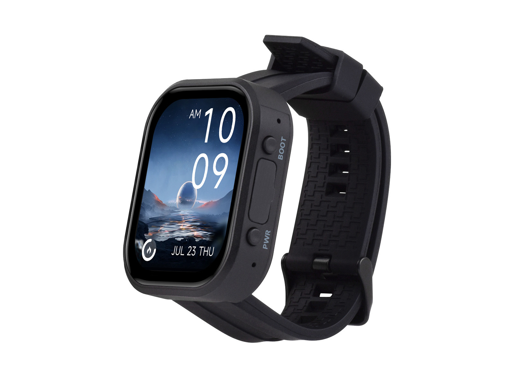

<div align="center">
  <h1>ESP32-C6-Touch-AMOLED-2.06</h1>
  <p><strong>ESP32-C6 2.06-inch 410 × 502 QSPI AMOLED touch development board</strong></p>
  <p><a href="README_ZH.md">简体中文</a></p>
  <p></p>
  <p>
    <a href="https://github.com/waveshareteam/ESP32-C6-Touch-AMOLED-2.06/actions/workflows/esp-idf-examples.yml"></a>
    <a href="https://github.com/waveshareteam/ESP32-C6-Touch-AMOLED-2.06/actions/workflows/arduino-examples.yml"></a>
    <a href="LICENSE"></a>
  </p>
  <p>
    <a href="https://www.waveshare.com/esp32-c6-touch-amoled-2.06.htm">🌐 Product Page</a> ·
    <a href="https://docs.waveshare.com/ESP32-C6-Touch-AMOLED-2.06">📚 Product Documentation</a> ·
    <a href="examples/esp-idf/">🧩 ESP-IDF Examples</a> ·
    <a href="examples/arduino/">🔧 Arduino Examples</a> ·
    <a href="docs/firmware.md">📦 Firmware Artifacts</a>
  </p>
</div>

---

## ✨ Overview

This repository provides example software, source-built firmware packages,
factory recovery firmware, and hardware references for the Waveshare
ESP32-C6-Touch-AMOLED-2.06.

The board combines an ESP32-C6 with a high-resolution AMOLED display,
capacitive touch, motion sensing, real-time clock, power management, and audio
interfaces in a compact watch-style development platform.

## 🖥️ Hardware Overview

| Feature | Device / interface |
| --- | --- |
| MCU | ESP32-C6, 32-bit RISC-V processor up to 160 MHz |
| Wireless | 2.4 GHz Wi-Fi 6, Bluetooth 5, Zigbee 3.0, and Thread |
| Memory | 16 MB external flash |
| Display | 2.06-inch 410 × 502 QSPI AMOLED using CO5300 |
| Touch | FT3168 capacitive touch controller over I²C |
| Power management | AXP2101 with battery charging support |
| Motion sensor | QMI8658 six-axis IMU |
| Real-time clock | PCF85063 |
| Audio | Onboard audio codec, microphone input, and speaker output |
| Board support | Managed component: [`waveshare/esp32_c6_touch_amoled_2_06`](https://components.espressif.com/components/waveshare/esp32_c6_touch_amoled_2_06) |
| Hardware files | [Schematic](Schematic/ESP32-C6-Touch-AMOLED-2.06-Schematic-V1.0.pdf) and [verified pin map](docs/hardware.md) |

## 📦 Firmware Artifacts

Every successful source build produces a ready-to-download ZIP in GitHub
Actions. Select an ESP-IDF or Arduino workflow run, open its **Artifacts**
section, and download the package matching the example and framework version.

Each archive contains the application and supporting binaries, exact flash
offsets, SHA-256 checksums, a metadata manifest, and flashing helpers. After
extracting the package and installing esptool with
`python -m pip install esptool`, run one of the generated helpers:

```sh
./flash.sh --port PORT
```

```bat
flash.bat --port PORT
```

> [!NOTE]
> The helper scripts preserve the offsets generated by the framework. Do not
> replace them with offsets from a different example or factory image.

The checked-in image under [firmware](firmware/) is a separate factory recovery
artifact and is not rebuilt by CI. See
[Firmware Artifacts and Flashing](docs/firmware.md) for details.

## 🧪 Examples

### ESP-IDF

| Example | Focus |
| --- | --- |
| [01_AXP2101](examples/esp-idf/01_AXP2101/) | Power management and battery telemetry |
| [02_lvgl_demo_v9](examples/esp-idf/02_lvgl_demo_v9/) | Display, touch, and LVGL 9 demos |
| [03_esp-brookesia](examples/esp-idf/03_esp-brookesia/) | ESP-Brookesia watch-style user interface |
| [04_qmi8658](examples/esp-idf/04_qmi8658/) | QMI8658 motion data and LVGL user interface |
| [05_Spec_Analyzer](examples/esp-idf/05_Spec_Analyzer/) | Audio capture, DSP, and spectrum visualization |

### Arduino

| Example | Focus |
| --- | --- |
| [01_HelloWorld](examples/arduino/01_HelloWorld/) | Display bring-up |
| [02_GFX_AsciiTable](examples/arduino/02_GFX_AsciiTable/) | GFX text and character rendering |
| [03_LVGL_PCF85063_simpleTime](examples/arduino/03_LVGL_PCF85063_simpleTime/) | RTC time display with LVGL |
| [04_LVGL_QMI8658_ui](examples/arduino/04_LVGL_QMI8658_ui/) | IMU data display with LVGL |
| [05_LVGL_AXP2101_ADC_Data](examples/arduino/05_LVGL_AXP2101_ADC_Data/) | Power telemetry display with LVGL |
| [06_LVGL_Arduino_v9](examples/arduino/06_LVGL_Arduino_v9/) | LVGL 9 feature demo |

Bundled Arduino libraries live under
[`examples/arduino/libraries`](examples/arduino/libraries/). Their upstream
library examples are intentionally excluded from the product CI matrix.

## 🛠️ Supported Toolchains

| Surface | Version | Firmware builds |
| --- | --- | ---: |
| ESP-IDF | `v5.5.5` | 5 |
| ESP-IDF | `v6.0.2` | 5 |
| Arduino-ESP32 | `3.3.8` | 6 |

The separate [ESP-IDF](https://github.com/waveshareteam/ESP32-C6-Touch-AMOLED-2.06/actions/workflows/esp-idf-examples.yml)
and [Arduino](https://github.com/waveshareteam/ESP32-C6-Touch-AMOLED-2.06/actions/workflows/arduino-examples.yml)
workflows run two always-visible discovery jobs and up to 16 firmware build
jobs. Documentation-only changes skip the firmware matrices while retaining
the lightweight policy and routing checks. Each successful build is packaged
as a flashable artifact. See
[Continuous Integration](docs/ci.md) for matrix and dispatch details.

The machine-readable source for toolchain versions and board options is
[`config/toolchains.json`](config/toolchains.json).

## 🗂️ Repository Layout

| Path | Purpose |
| --- | --- |
| [`examples/esp-idf/`](examples/esp-idf/) | First-party ESP-IDF applications |
| [`examples/arduino/`](examples/arduino/) | First-party Arduino sketches and bundled libraries |
| [`firmware/`](firmware/) | Factory flashing and recovery image |
| [`releases/`](releases/) | Firmware packaging tools |
| [`Schematic/`](Schematic/) | Public schematic files |
| [`config/`](config/) | CI toolchain versions and board options |
| [`docs/`](docs/) | CI, component, hardware, and firmware notes |

Canonical example paths are independent of framework versions. Update
`config/toolchains.json` when the supported CI baselines change instead of
creating version-suffixed example roots.

## 📚 Documentation

- [Product Documentation](https://docs.waveshare.com/ESP32-C6-Touch-AMOLED-2.06)
- [Hardware Pin Audit](docs/hardware.md)
- [Continuous Integration](docs/ci.md)
- [Managed Components](docs/components.md)
- [Firmware Artifacts and Flashing](docs/firmware.md)
- [Release Tools](releases/README.md)

## 🤝 Support and Contributions

Contributions and reproducible issue reports are welcome. Include the example
path, framework version, reproduction steps, expected behavior, actual
behavior, and relevant serial logs.

- [Contributing Guide](CONTRIBUTING.md)
- [Support](SUPPORT.md)
- [Security Policy](SECURITY.md)
- [Open an Issue](https://github.com/waveshareteam/ESP32-C6-Touch-AMOLED-2.06/issues/new/choose)

## 📄 License

This repository is licensed under the Apache License 2.0. See
[LICENSE](LICENSE).
